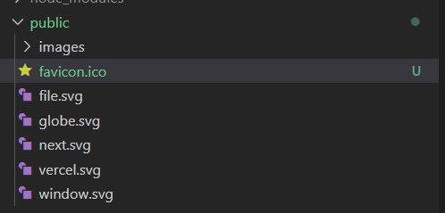
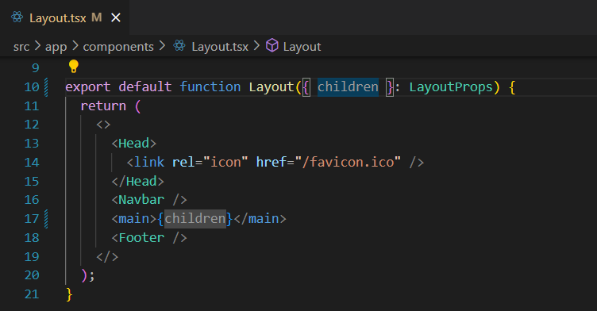
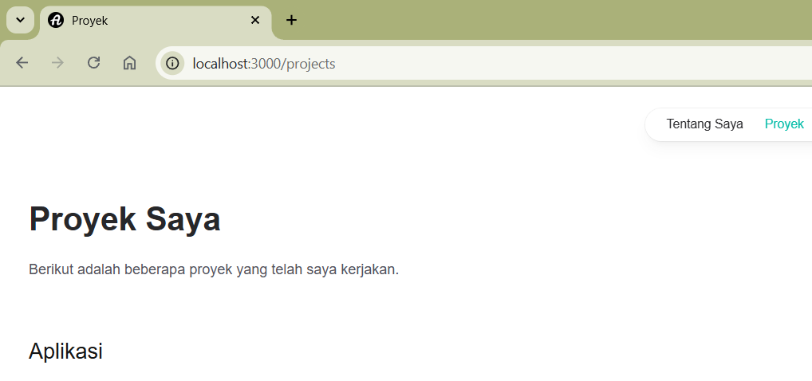

| Nama                | NIM        | Kelas | No Absen |
|---------------------|------------|-------|----------|
| Astrid Risa Widiana | 2241720250 | TI-3A | 05       |

# **JOBSHEET 10 - Membuat Halaman yang SEO-Friendly dengan Next.js**

> **Note :** 
Pada jobsheet ini menggunakan proyek "website-pribadi" yang telah dibuat pada jobsheet sebelumnya yaitu "JOBSHEET 5 - Membangun Website Pribadi dengan Next.js (App Router), React, dan Tailwind CSS"

# **Langkah-langkah Praktikum**
## **1. Memahami Pentingnya SEO**
SEO (Search Engine Optimization) adalah praktik mengoptimalkan website agar mudah ditemukan oleh mesin pencari seperti Google. Dengan SEO yang baik, website Anda akan lebih mudah muncul di hasil pencarian, sehingga meningkatkan traffic pengunjung.

Beberapa elemen penting dalam SEO:

•	Title Tag: Judul halaman yang muncul di hasil pencarian.

•	Meta Description: Deskripsi singkat tentang halaman.

•	Heading Tags (H1, H2, dll.): Struktur konten yang membantu mesin pencari memahami isi halaman.

•	URL Structure: URL yang deskriptif dan mudah dibaca.

•	Open Graph Tags: Metadata untuk media sosial seperti Facebook dan Twitter.

•	Favicon: Ikon kecil yang muncul di tab browser.

## **2. Menambahkan Favicon**
1.	Siapkan file favicon (format .ico) dan letakkan di folder public/.
    
2.	Hapus faveicon.ico yang ada di folder src/app
3.	Update file src/components/layout.tsx untuk menambahkan favicon:
    
4.	Simpan dan jalankan proyek. Favicon akan muncul di tab browser.
    **HASIL**

    

## **3. Menambahkan Metadata untuk SEO**
## **4. Open Graph Tags untuk Media Sosial**
## **5. Menguji SEO**

## **Tugas** 
Lakukan pengujian SEO dengan
1.	Gunakan tools seperti Google Search Console untuk memeriksa performa SEO dari suatu website.
