| Nama                | NIM        | Kelas | No Absen |
|---------------------|------------|-------|----------|
| Astrid Risa Widiana | 2241720250 | TI-3A | 05       |


# **JOBSHEET 2 - Components, JSX, dan Props**

# **Langkah-langkah Praktikum**
## **1. Persiapan Lingkungan**
1. Pastikan Node.js dan npm sudah terinstal di komputer Anda. Anda dapat memeriksanya dengan menjalankan perintah berikut di terminal atau command prompt:
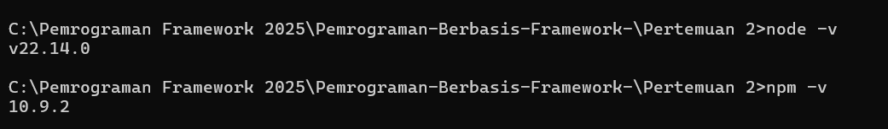
2. Buat direktori baru untuk proyek React Anda:
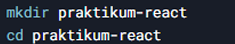
3. Inisialisasi proyek React dengan menjalankan perintah berikut:
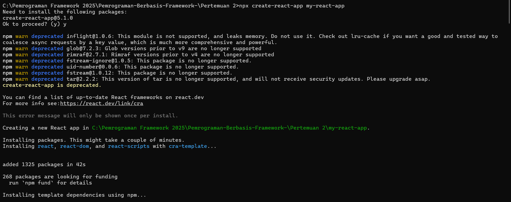
4. Jalankan aplikasi React dengan perintah:
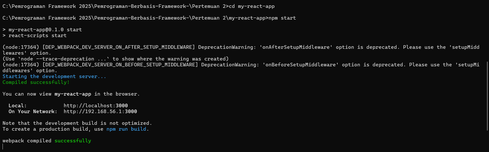 

Aplikasi akan terbuka di browser pada alamat http://localhost:3000.
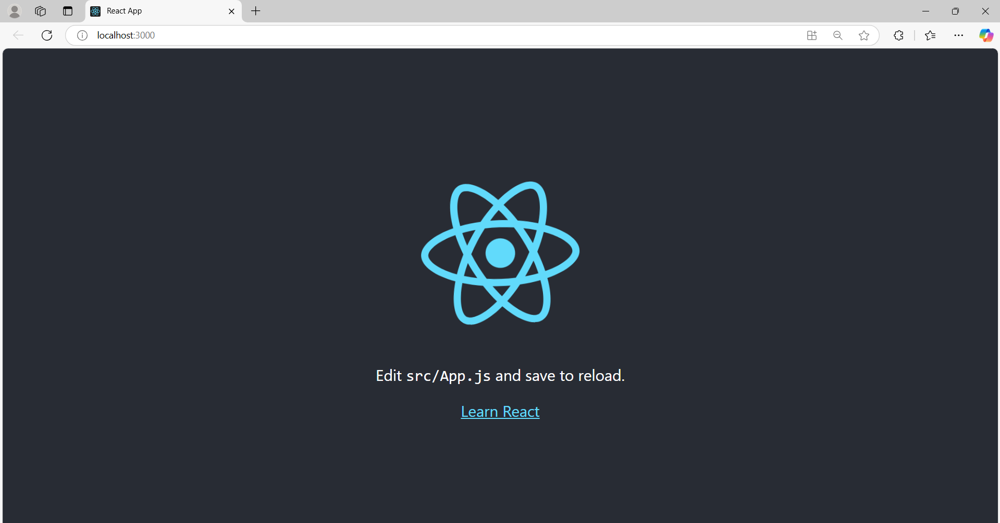


## **2. Membuat Komponen React**
1. Buka file src/App.js di text editor Anda.
2. Ganti kode di dalamnya dengan kode berikut untuk membuat komponen sederhana:
    ```JavaScript
    // Praktikum 2  Membuat Komponen React

    import React from 'react';

    // Komponen Header
    function Header () {
        return (
            <header>
                <h1>Aplikasi React Saya</h1>
            </header>
        );
    }

    // Komponen Main
    function Main () {
    return (
        <main>
        <h2>Selamat datang di Aplikasi React Saya!</h2>
        <p>Ini adalah area konten utama</p>
        </main>
    );
    }

    // Komponen Footer
    function Footer () {
    return (
        <footer>
        <p>&copy; 2023 Aplikasi React Saya</p>
        </footer>
    );
    }

    // Komponen App yang menggunakan Header, Main, dan Footer
    function App () {
    return (
        <div>
        <Header />
        <Main />
        <Footer />
        </div>
    );
    }

    export default App; // Untuk mengexport komponen App ke file lainnya
    ```
3. Simpan file dan lihat perubahan di browser. Anda akan melihat tampilan sederhana dengan header, konten utama, dan footer.
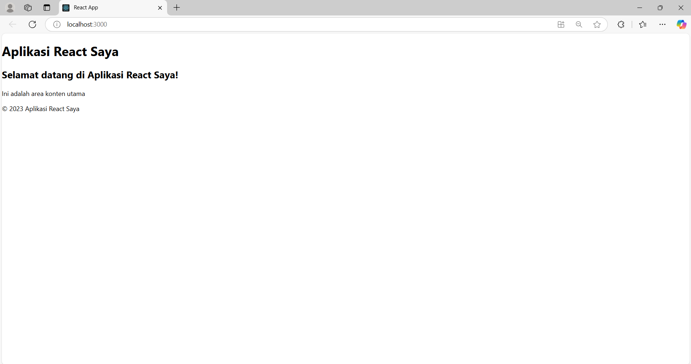

## **3. Menggunakan JSX untuk Membuat Komponen Dinamis**
1. Buat file baru di direktori src dengan nama Counter.js.
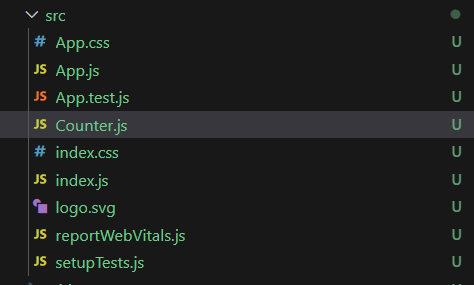
2. Tambahkan kode berikut untuk membuat komponen Counter yang dinamis:
    ```javascript
    // Praktikum 3 Menggunakan JSX untuk Membuat Komponen Dinamis

    import React, { useState } from 'react';

    function Counter() {
        const [count, setCount] = useState(0);

        function handleClick() {
            setCount(count + 1);
        }

        return (
            <div>
                <h1>Hitungan: {count}</h1>
                <button onClick={handleClick}>Tambah</button>
            </div>
        );
    }

    export default Counter;
    ```
3. Buka file src/App.js dan impor komponen Counter:
    `import Counter from './Counter'; // Praktikum 3 Langkah 3 `
4. Tambahkan komponen Counter ke dalam komponen App:
    ```javascript
        function App () {
        return (
            <div>
            <Header />
            <Main />
            <Counter /> 
            <Footer />
            </div>
        );
        }
        ```
5. Simpan file dan lihat perubahan di browser. Anda akan melihat tombol "Tambah" yang dapat meningkatkan hitungan saat diklik.
<video controls src="../img/HP3.mp4" title="Title"></video>


## **4. Menggunakan Props untuk Mengirim Data**
1. Buat file baru di direktori src dengan nama Greeting.js.
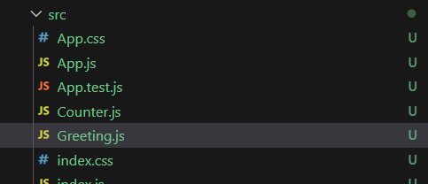 
2. Tambahkan kode berikut untuk membuat komponen Greeting yang menerima props:
    ```javascript
    // Praktikum 4 Menggunakan Props untuk Mengirim Data 

    function Greeting(props) {
        return <h1>Halo. {props.name}!</h1>
    }

    export default Greeting;
    ```
3. Buka file src/App.js dan impor komponen Greeting:
    `import Greeting from './Greeting'; // Praktikum 4 Langkah 3`
4. Tambahkan komponen Greeting ke dalam komponen App dan kirim props name:
    ```javascript
    function App () {
    return (
        <div>
        <Header />
        <Main />
        <Greeting name="Astrid"/>
        <Counter /> 
        <Footer />
        </div>
    );
    }
    ```
5. Simpan file dan lihat perubahan di browser. Anda akan melihat pesan "Halo, John!" yang ditampilkan oleh komponen Greeting.
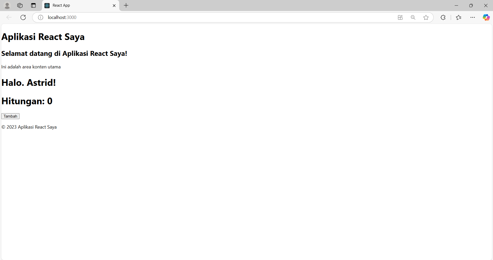

## **5. Menggunakan State untuk Mengelola Data** 
1. Buka file src/App.js dan tambahkan kode berikut untuk membuat komponen yang mengelola state: 
    ```javascript
    // Praktikum 5 Menggunakan State untuk Mengelola Data
    import React, { useState } from 'react';

    function Example() {
    const [name, setName] = useState('');
    const [age, setAge] = useState(0);
    const [email, setEmail] = useState('');

    const handleNameChange = (e) => {
        setName(e.target.value);
    };

    const handleAgeChange = (e) => {
        setAge(e.target.value);
    };

    const handleEmailChange = (e) => {
        setEmail(e.target.value);
    };

    return (
        <div>
            <input type="text" placeholder="Nama" value={name} onChange={handleNameChange} />
            <input type="number" placeholder="Umur" value={age} onChange={handleAgeChange} />
            <input type="email" placeholder="Email" value={email} onChange={handleEmailChange} />
            <p>{name} berumur {age} tahun dan emailnya adalah {email}.</p>
        </div>
    );
    }
    ```
2. Tambahkan komponen Example ke dalam komponen App:
    ```javascript
    function App () {
    return (
        <div>
        <Header />
        <Main />
        <Greeting name="Astrid"/>
        <Counter /> 
        <Example />
        <Footer />
        </div>
    );
    }
    ``` 
3. Simpan file dan lihat perubahan di browser. Anda akan melihat form input yang dapat mengupdate state dan menampilkan data yang dimasukkan.
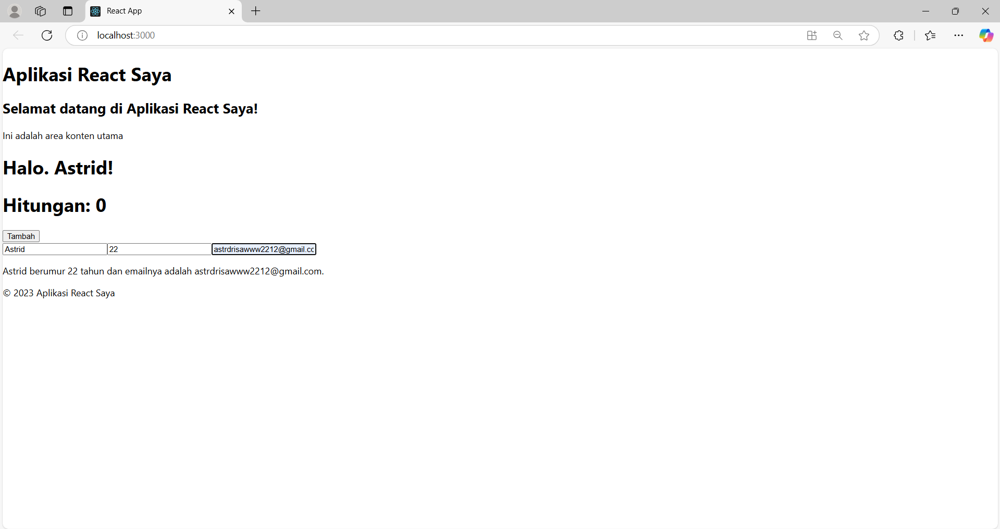 

### **Tugas** 
1. Buat komponen baru bernama TodoList yang menampilkan daftar tugas (todo list). Gunakan 
state untuk mengelola daftar tugas dan props untuk mengirim data tugas ke komponen anak. 
2. Tambahkan fitur untuk menambahkan tugas baru ke dalam daftar menggunakan form input. 
3. Implementasikan fitur untuk menghapus tugas dari daftar. 

### **Penyelesaian**
1. Buat file baru di direktori src dengan nama TodoList.js.
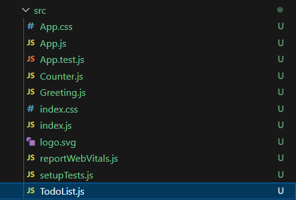
2. Tambahkan kode berikut untuk membuat komponen TodoList.
    ```javascript
    import React, { useState } from 'react';

    function TodoItem({ task, onDelete }) {  // Komponen anak yang menerima props task dan onDelete
    return (
        <li className="flex justify-between items-center bg-gray-100 p-2 rounded-lg mb-2 shadow-sm">
        <span>{task}</span>
        <button
            onClick={onDelete}
            className="bg-red-500 text-white px-2 py-1 rounded-lg hover:bg-red-600"
        >
            Hapus
        </button>
        </li>
    );
    }

    function TodoList() {
    const [tasks, setTasks] = useState(["Belajar React", "Mengerjakan tugas", "Membaca buku"]);  //useState([]): Digunakan untuk mengelola daftar tugas
    const [newTask, setNewTask] = useState('');   // State untuk input tugas baru

    const handleAddTask = (e) => {
        e.preventDefault();
        if (newTask.trim() !== '') {   // Memastikan input tidak kosong
        setTasks([...tasks, newTask]);  // Menambahkan tugas baru ke daftar
        setNewTask('');   // Mengosongkan input setelah tugas ditambahkan
        }
    };

    const handleDeleteTask = (index) => {
        setTasks(tasks.filter((_, i) => i !== index));   // Menghapus tugas berdasarkan index
    };

    return (
        <div className="max-w-md mx-auto p-4 bg-white rounded-lg shadow-lg">
        <h2 className="text-lg font-bold mb-4">List Tugas</h2>
        <form onSubmit={handleAddTask} className="flex gap-2 mb-4">
            <input
            type="text"
            placeholder="Tambahkan tugas"
            value={newTask}
            onChange={(e) => setNewTask(e.target.value)}
            className="flex-1 p-2 border rounded-lg"
            />
            <button
            type="submit"
            className="bg-blue-500 text-white px-4 py-2 rounded-lg hover:bg-blue-600"
            >
            Tambah
            </button>
        </form>
        <ul>
            {tasks.map((task, index) => (
            <TodoItem key={index} task={task} onDelete={() => handleDeleteTask(index)} />
            ))}
        </ul>
        </div>
    );
    }

    export default TodoList;
    ```
3. Buka file src/App.js dan impor komponen TodoList:
    `import TodoList from './TodoList'; //TUGAS`
4. Tambahkan komponen TodoList ke dalam komponen App:
    ```javascript
    Function App () {
    return (
        <div>
        <Header />
        <Main />
        <Greeting name="Astrid"/>
        <Counter /> 
        <Example />
        <TodoList />
        <Footer />
        </div>
    );
    }
    ```
### **HASIL**
<video controls src="../img/TUGAS.mp4" title="Title"></video>


