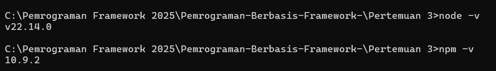
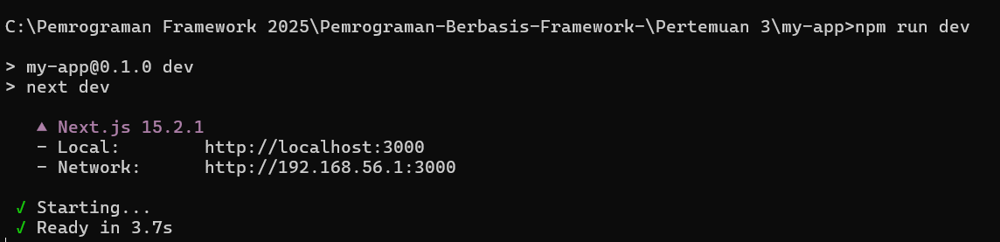
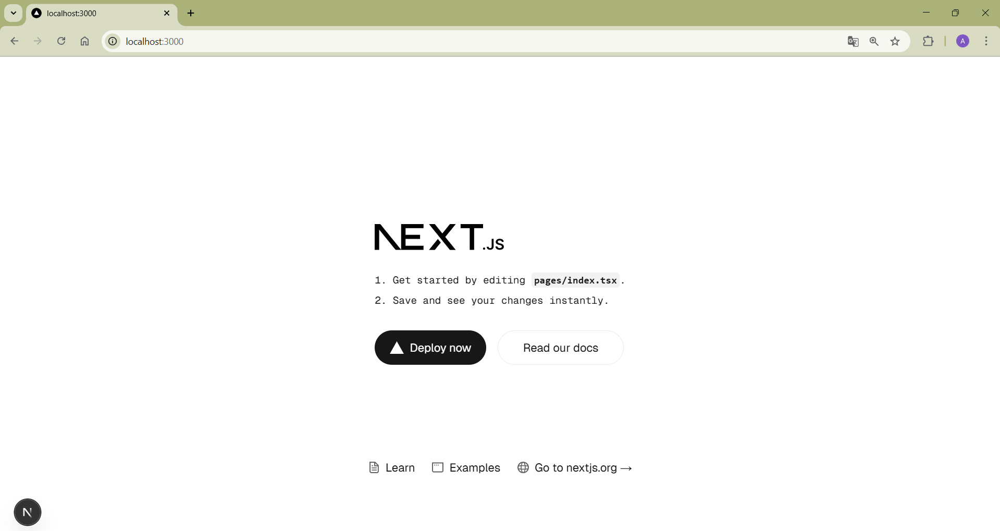
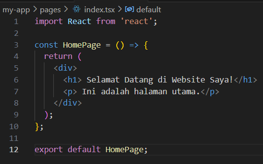
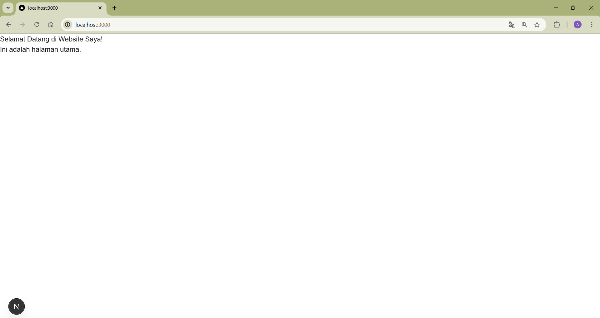
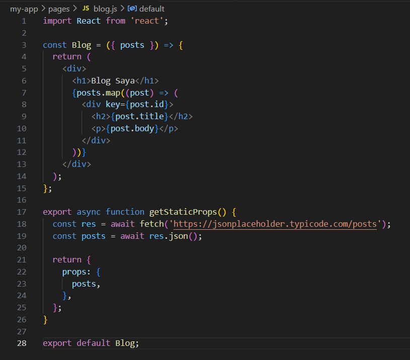
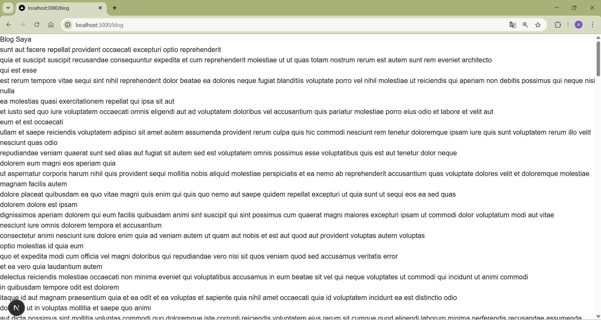

| Nama                | NIM        | Kelas | No Absen |
|---------------------|------------|-------|----------|
| Astrid Risa Widiana | 2241720250 | TI-3A | 05       |

# **JOBSHEET 3 - Pengenalan Next.js**

# **Langkah-langkah Praktikum**
## **1. Persiapan Lingkungan**
1. Pastikan Node.js dan npm sudah terinstal di komputer Anda. Anda dapat memeriksanya dengan 
menjalankan perintah berikut di terminal atau command prompt:

2. Buat direktori baru untuk proyek Next.js Anda 
3. Inisialisasi proyek Next.js dengan menjalankan perintah berikut: Perhatikan bahwa App Router 
belum digunakan

4. Jalankan aplikasi Next.js dengan perintah:

Aplikasi akan terbuka di browser pada alamat http://localhost:3000.
 

## **2. Membuat Halaman dengan Server-Side Rendering (SSR)**
1. Buka file pages/index.tsx di text editor Anda. 
2. Ganti kode di dalamnya dengan kode berikut untuk membuat halaman sederhana:

3. Simpan file dan lihat perubahan di browser. Anda akan melihat halaman utama dengan teks "Selamat Datang di Website Saya!". 

## **3. Menggunakan Static Site Generation (SSG)**
1. Buat file baru di direktori pages dengan nama blog.js. 
2. Tambahkan kode berikut untuk membuat halaman blog dengan SSG:

3. Simpan file dan buka http://localhost:3000/blog di browser. Anda akan melihat daftar post yang diambil dari API eksternal.
