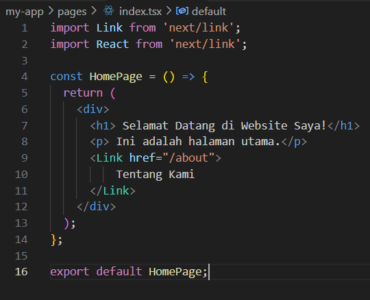

| Nama                | NIM        | Kelas | No Absen |
|---------------------|------------|-------|----------|
| Astrid Risa Widiana | 2241720250 | TI-3A | 05       |

# **JOBSHEET 3 - Pengenalan Next.js**

# **Langkah-langkah Praktikum**
## **1. Persiapan Lingkungan**
1. Pastikan Node.js dan npm sudah terinstal di komputer Anda. Anda dapat memeriksanya dengan 
menjalankan perintah berikut di terminal atau command prompt:

2. Buat direktori baru untuk proyek Next.js Anda 
3. Inisialisasi proyek Next.js dengan menjalankan perintah berikut: Perhatikan bahwa App Router 
belum digunakan

4. Jalankan aplikasi Next.js dengan perintah:

Aplikasi akan terbuka di browser pada alamat http://localhost:3000.
 

## **2. Membuat Halaman dengan Server-Side Rendering (SSR)**
1. Buka file pages/index.tsx di text editor Anda. 
2. Ganti kode di dalamnya dengan kode berikut untuk membuat halaman sederhana:

3. Simpan file dan lihat perubahan di browser. Anda akan melihat halaman utama dengan teks "Selamat Datang di Website Saya!". 

## **3. Menggunakan Static Site Generation (SSG)**
1. Buat file baru di direktori pages dengan nama blog.js. 
2. Tambahkan kode berikut untuk membuat halaman blog dengan SSG:

3. Simpan file dan buka http://localhost:3000/blog di browser. Anda akan melihat daftar post yang diambil dari API eksternal.

## **4. Menggunakan Dynamic Routes**
1. Buat direktori baru di pages dengan nama blog. 
2. Buat file di dalam direktori blog dengan nama [slug].js 
3. Tambahkan kode berikut untuk membuat halaman dinamis berdasarkan slug:

4. Simpan file dan buka http://localhost:3000/blog/contoh-post di browser. Anda akan melihat halaman yang menampilkan slug dari URL.

## **5. Menggunakan API Routes**
1. Pastikan terdapat direktori di pages dengan nama api. 
2. Buat file di dalam direktori api dengan nama products.js. 
3. Tambahkan kode berikut untuk membuat API route yang mengembalikan daftar produk:

4. Buat file baru di pages dengan nama products.js untuk menampilkan daftar produk:

5. Simpan file dan buka http://localhost:3000/products di browser. Anda akan melihat daftar produk yang diambil dari API route.

## **6. Menggunakan Link Component**
1. Buka file pages/index.tsx dan tambahkan modif dengan kode berikut untuk membuat link ke halaman lain:

2. Buat file baru di pages dengan nama about.js untuk halaman "Tentang Kami":

3. Simpan file dan buka http://localhost:3000 di browser. Klik link "Tentang Kami" untuk navigasi ke halaman tentang.
.png)
.png)

## **Tugas** 
1. Buat halaman baru dengan menggunakan Static Site Generation (SSG) yang menampilkan daftar pengguna dari API https://jsonplaceholder.typicode.com/users. 

    **Langkah-langkah:**

- Buat direktori baru di pages dengan nama users. 
- Buat file di dalam direktori users dengan nama index.js
- Tambahkan kode berikut:
    
- Simpan file dan buka http://localhost:3000/users di browser.
    

2. Implementasikan Dynamic Routes untuk menampilkan detail pengguna berdasarkan ID. 

    **Langkah-langkah:**

- Buat file di dalam direktori users dengan nama [id].js
- Tambahkan kode berikut:
    
- Simpan file dan buka http://localhost:3000/users/1 → Detail pengguna dengan ID 1 di browser.
    

3. Buat API route yang mengembalikan data cuaca dari API eksternal (misalnya, 
OpenWeatherMap) dan tampilkan data tersebut di halaman front-end.

    **Langkah-langkah:**

- Buat file di dalam direktori api dengan nama weather.js
- Tambahkan kode berikut:
    
- Buat file di dalam direktori page dengan nama weather.js
- Tambahkan kode berikut:
    
- Simpan file dan buka http://localhost:3000/weather
