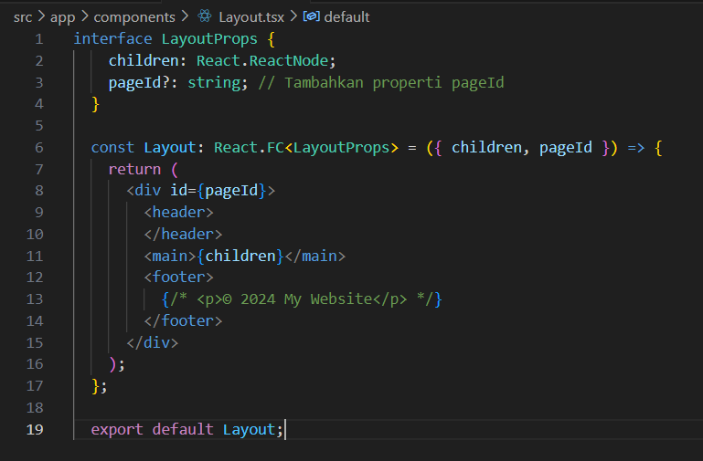
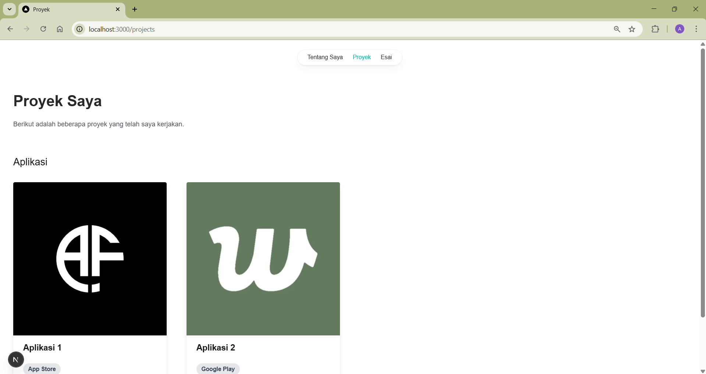

| Nama                | NIM        | Kelas | No Absen |
|---------------------|------------|-------|----------|
| Astrid Risa Widiana | 2241720250 | TI-3A | 05       |


# **JOBSHEET 5 - Membangun Website Pribadi dengan Next.js (App Router), React, dan Tailwind CSS**

# **Langkah-langkah Praktikum**
## **1. Persiapan Lingkungan**
1. Pastikan Node.js dan npm sudah terinstal di komputer Anda. Anda dapat memeriksanya dengan menjalankan perintah berikut di terminal atau command prompt: 

    

2. Buat direktori baru untuk proyek Next.js Anda: 

    

3. Inisialisasi proyek Next.js dengan TypeScript dan App Router: 

    

4. Cek konfigurasi postcss.config.mjs: 

    

5. Cek di app/globals.css, sudah ada import untuk tailwindcss:

    
    
6. Buka app/layout.tsx, tambahkan import './globals.css', dan modifikasi menjadi sebagai berikut:

    

7. Jalankan aplikasi Next.js:

    

8. Aplikasi akan terbuka di browser pada alamat http://localhost:3000.

    

## **2. Membuat Halaman Website**
Website pribadi akan memiliki tiga halaman: 
- Tentang Saya: Halaman berisi profil singkat dan link ke media sosial. 
- Proyek: Halaman untuk menampilkan proyek-proyek yang telah diselesaikan. 
- Esai: Halaman untuk menampilkan daftar artikel yang telah ditulis.

### **Langkah-langkah**
1. Buat file app/page.tsx sebagai halaman "Tentang Saya":

    

2. Buat file app/projects/page.tsx sebagai halaman "Proyek":

    

3. Buat file app/essays/page.tsx sebagai halaman "Esai":

    

4. Buka browser dan akses:
    - http://localhost:3000/ untuk halaman "Tentang Saya".

        .png)

    - http://localhost:3000/projects untuk halaman "Proyek".

        .png)

    - http://localhost:3000/essays untuk halaman "Esai".

        .png)


## **3. Membuat Layout dan Navigasi**
Layout digunakan untuk menyediakan struktur yang konsisten di seluruh halaman, seperti navbar dan footer.

### **Langkah-langkah**
1. Buat direktori src/components jika belum ada. 
2. Buat file src/components/Layout.tsx:

    

3. Buat file src/components/Navbar.tsx

    ```javascript
        'use client';

    import { usePathname } from 'next/navigation';

    type NavItemProps = {
    title: string;
    url: string;
    isSelected: boolean;
    };

    function NavItem({ title, url, isSelected }: NavItemProps) {
    return (
        <li>
        <a
            href={url} // Perbaiki typo ur1 menjadi url
            className={`block px-3 py-2 transition hover:text-teal-500 ${
            isSelected ? 'text-teal-500' : ''
            }`}
        >
            {title}
        </a>
        </li>
    );
    }

    export default function Navbar() {
    const pathname = usePathname();

    return (
        <div className="flex justify-center mx-auto max-w-7xl h-16 pt-6">
        <nav>
        <ul className="flex rounded-full bg-white/90 px-3 text-sm font-medium text-zinc-800 shadow-lg shadow-zinc-800/5 ring-1 ring-zinc-900/5 backdrop-blur">
            <NavItem
            title="Tentang Saya"
            url="/"
            isSelected={pathname === '/'}
            />
            <NavItem
            title="Proyek"
            url="/projects"
            isSelected={pathname === '/projects'}
            />
            <NavItem
            title="Esai"
            url="/essays"
            isSelected={pathname === '/essays'}
            />
        </ul>
        </nav>
        </div>
    );
    }
    ```

4. Buat file src/components/Footer.tsx 

    

5. Update file app/layout.tsx untuk menggunakan layout:

    

6. Update setiap halaman menambahkan metadata dengan generateMetadata:

    

Lakukan hal yang sama untuk halaman projects/page.tsx dan essays/page.tsx. 
    .png)
    .png)

### **HASIL**


## **4. Membuat Halaman Proyek dengan Grid Responsif**
Halaman proyek akan menampilkan daftar proyek dalam bentuk grid yang responsif.

### **Langkah-langkah**
1. Buat folder di public/images. Kemudian tambahkan dua image, lalu rename dengan nama project1.png dan project2.png 

    

2. Modifikasi file app/projects/page.tsx:

    - Tambahkan import next/image dan beberapa image yang telah ditambahkan sebelumnya

        .png)

    - Buat card project item sebagai berikut:

        .png)

    - Modifikasi komponen project sebagai berikut:

        .png)

3. Simpan file dan buka http://localhost:3000/projects di browser. Anda akan melihat daftar proyek dalam grid yang responsif.

    

## **Tugas** 
Eksplorasi Tailwindcss, kemudian. 
1. Modifikasi halaman "Esai" dengan Grid daftar artikel yang telah ditulis.

    ### **Langkah-langkah**
    1. install modul @heroicons/react

        

    2. Tambahkan import

        

    3. Modifikasi komponen project sebagai berikut:

        

    ### **HASIL**
    

2. Modifikasi halaman “Tentang Saya” Buat tampilan yang menarik
### **Langkah-langkah**
1. Modifikasi pada src/app/page.tsx
    ```javascript
    import Image from "next/image";
    import type { Metadata } from "next";
    import { QrCodeIcon, LightBulbIcon, UserIcon } from "@heroicons/react/24/outline";

    export const metadata: Metadata = {
    title: "Tentang Saya",
    description: "Halaman tentang saya.",
    openGraph: {
        title: "Tentang Saya",
        description: "Halaman tentang saya.",
    },
    };

    export default function Home() {
    return (
        <div className="mt-16 px-8">
        <header className="text-center">
            <h1 className="font-bold text-4xl text-zinc-800">Tentang Saya</h1>
            <p className="text-base mt-4 text-zinc-600 max-w-2xl mx-auto">
            Saya adalah seorang UI/UX Designer dan Frontend Developer dengan pengalaman dalam membangun tampilan aplikasi yang menarik dan fungsional.
            </p>
        </header>

        {/* Foto Profil */}
        <div className="mt-10 flex justify-center">
            <Image
            src="/images/profile.jpg" 
            width={150}
            height={150}
            alt="Foto Profil"
            className="rounded-full shadow-lg"
            />
        </div>

        {/* Keahlian */}
        <div className="mt-10">
            <h2 className="text-2xl font-semibold text-zinc-800 text-center">Keahlian</h2>
            <div className="grid grid-cols-1 md:grid-cols-3 gap-6 mt-6 text-center">
            <div className="p-4 rounded-lg bg-gray-100 shadow-md">
                <UserIcon className="w-10 h-10 text-teal-500 mx-auto" />
                <p className="mt-2 font-medium text-zinc-700">UI/UX Design</p>
            </div>
            <div className="p-4 rounded-lg bg-gray-100 shadow-md">
                <QrCodeIcon className="w-10 h-10 text-teal-500 mx-auto" />
                <p className="mt-2 font-medium text-zinc-700">Frontend Development</p>
            </div>
            <div className="p-4 rounded-lg bg-gray-100 shadow-md">
                <LightBulbIcon className="w-10 h-10 text-teal-500 mx-auto" />
                <p className="mt-2 font-medium text-zinc-700">Problem Solving</p>
            </div>
            </div>
        </div>

        {/* Sosial Media */}
        <div className="mt-10 text-center">
            <h2 className="text-2xl font-semibold text-zinc-800">Temui Saya</h2>
            <div className="flex justify-center gap-4 mt-4">
            <a href="https://github.com/astrdrisa" className="text-teal-500 hover:underline">GitHub</a>
            <a href="https://linkedin.com/in/astrid-risa-widiana-b6a8811a3/" className="text-teal-500 hover:underline">LinkedIn</a>
            </div>
        </div>
        </div>
    );
    }
    ```

### **HASIL**


